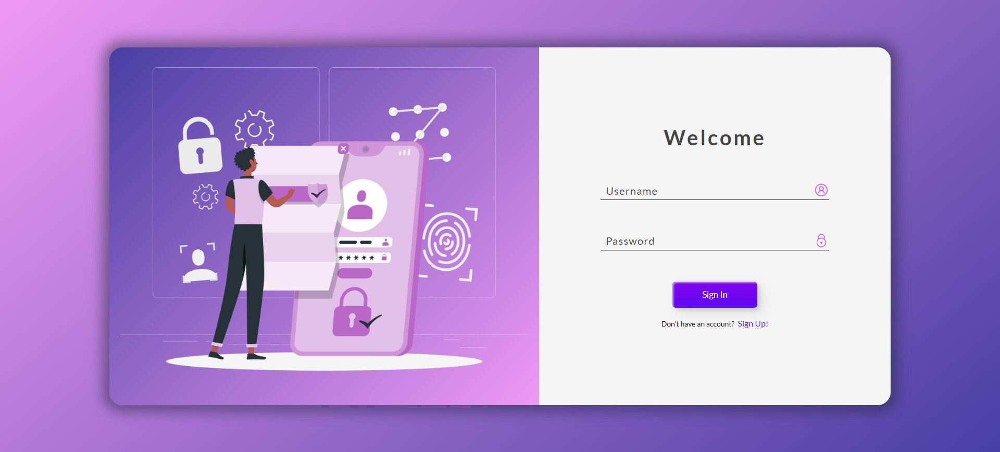

# Login Page

This project features a simple login page built with HTML, CSS, and JavaScript. It also includes a folder with images.

## Contents

- `index.html`: The main HTML structure.
- `style.css`: Styles for the page.
- `custom.js`: JavaScript for interactions.
- `img/`: Folder containing 4 images.

## Features

- Responsive design
- Custom styles with CSS
- Basic interactions with JavaScript

## Usage

1. Enter your username and password.
2. Click the "Sign In" button.

## Contributing

To contribute to this project:
1. Fork the repository.
2. Make your changes.
3. Create a Pull Request.

## PREVIEW

